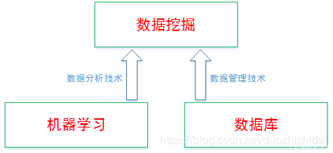
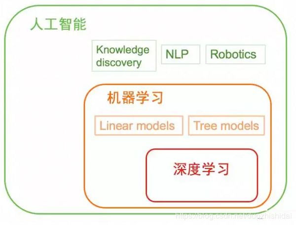

- [一 概念澄清](#%e4%b8%80-%e6%a6%82%e5%bf%b5%e6%be%84%e6%b8%85)
  - [1. 人工智能(Artificial Intelligence)](#1-%e4%ba%ba%e5%b7%a5%e6%99%ba%e8%83%bdartificial-intelligence)
  - [2. 机器学习(Machine Learning)](#2-%e6%9c%ba%e5%99%a8%e5%ad%a6%e4%b9%a0machine-learning)
  - [3. 深度学习(Deep Learning)](#3-%e6%b7%b1%e5%ba%a6%e5%ad%a6%e4%b9%a0deep-learning)
  - [4. 数据挖掘(Data Mining)](#4-%e6%95%b0%e6%8d%ae%e6%8c%96%e6%8e%98data-mining)
  - [5. 关系](#5-%e5%85%b3%e7%b3%bb)
- [二 人工智能](#%e4%ba%8c-%e4%ba%ba%e5%b7%a5%e6%99%ba%e8%83%bd)
  - [1 评判标准 -- 图灵测试](#1-%e8%af%84%e5%88%a4%e6%a0%87%e5%87%86----%e5%9b%be%e7%81%b5%e6%b5%8b%e8%af%95)
  - [2. 等级划分](#2-%e7%ad%89%e7%ba%a7%e5%88%92%e5%88%86)
- [三 机器学习](#%e4%b8%89-%e6%9c%ba%e5%99%a8%e5%ad%a6%e4%b9%a0)
  - [1. 类别](#1-%e7%b1%bb%e5%88%ab)
  - [2. 实现过程](#2-%e5%ae%9e%e7%8e%b0%e8%bf%87%e7%a8%8b)
  - [i. 抽象](#i-%e6%8a%bd%e8%b1%a1)
  - [ii. 数据处理](#ii-%e6%95%b0%e6%8d%ae%e5%a4%84%e7%90%86)
  - [iii. 构建模型](#iii-%e6%9e%84%e5%bb%ba%e6%a8%a1%e5%9e%8b)
  - [iv. 模型测试](#iv-%e6%a8%a1%e5%9e%8b%e6%b5%8b%e8%af%95)
  - [v. 模型调优](#v-%e6%a8%a1%e5%9e%8b%e8%b0%83%e4%bc%98)
  - [vi. 模型部署](#vi-%e6%a8%a1%e5%9e%8b%e9%83%a8%e7%bd%b2)

## 一 概念澄清

### 1. 人工智能(Artificial Intelligence)

人工智能是计算机科学的一个分支，它企图了解智能的实质，并生产出一种新的能以人类智能相似的方式做出反应的智能机器，该领域的研究包括语音识别、图像识别、机器人、自然语言处理、智能搜索和专家系统等。人工智能可以对人的意识、思维的信息过程的模拟。人工智能不是人的智能，但能像人那样思考、也有可能超过人的智能。

### 2. 机器学习(Machine Learning)

机器学习是指用某些算法指导计算机利用已知数据得出适当的模型，并利用此模型对新的情境给出判断的过程。

### 3. 深度学习(Deep Learning)

深度学习是实现机器学习的一种方式。深度学习的概念源于人工神经网络(ANN)的研究。深度学习的动机在于建立、模拟人脑进行分析学习的神经网络，它模仿人脑的机制来解释数据，例如图像，声音和文本。其核心是模拟和学习人类大脑的神经元工作方式，比如其按特定的物理距离连接；而深度学习使用独立的层、连接，还有数据传播方向。

### 4. 数据挖掘(Data Mining)

数据挖掘就是从海量数据中“挖掘”隐藏信息。数据是“大量的、不完全的、有噪声的、模糊的、随机的实际应用数据”，信息指的是“隐含的、规律性的、人们事先未知的、但又是潜在有用的并且最终可理解的信息和知识”。在商业环境中，企业希望让存放在数据库中的数据能“说话”，支持决策。所以，数据挖掘更偏向应用。

<!-- more -->

### 5. 关系

严格意义上说，人工智能和机器学习没有直接关系，只不过目前机器学习的方法被大量的应用于解决人工智能的问题而已。目前机器学习是人工智能的一种实现方式，也是最重要的实现方式。

早期的机器学习实际上是属于统计学，而非计算机科学的;而二十世纪九十年代之前的经典人工智能跟机器学习也没有关系。所以今天的AI和ML有很大的重叠，但并没有严格的从属关系。

不过如果仅就计算机系内部来说，ML是属于AI的。AI今天已经变成了一个很泛泛的学科了。

深度学习是机器学习现在比较火的一个方向，其本身是神经网络算法的衍生，在图像、语音等的分类和识别上取得了非常好的效果。

## 二 人工智能

### 1 评判标准 -- 图灵测试

图灵测试是著名科学家阿兰·麦席森·图灵于1950年提出的。其内容是，如果计算机程序能在5分钟内回答由人类测试者提出的一系列问题，且其超过30%的回答让测试者误认为是人类所答，则该程序通过测试，表明该程序拥有接近于人类的智能。

图灵测试的参与者包含一名或多名评委，两名测试者。其中一名测试者是人类，另一名测试者是计算机程序。在评委不能直接看到测试者的情况下，由评委提出若干问题，然后根据回答做出自己的判断。

图灵测试本质上要回答的问题是“机器能思考吗？”，而判断的方式是人和人人工智能对于评委来说谁是人的概率更高。

完全图灵测试和反图灵测试。传统图灵测试一般避免受试者与评委产生物理沟通，而完全图灵测试则可以包含必要的人机在物理层面上的交互，比如感知能力与操纵物体的能力。反图灵测试--验证码。

### 2. 等级划分

按照智能的高低，人工智能可以分为三个等级：

弱人工智能(Artificial Narrow Intelligence，简称ANI)。指的是在单一领域具有一定智能的程序。现在人们所研究出的人工智能基本都属于弱人工智能这一层次，比如AlphaGo的专属领域是围棋，谷歌翻译的专属领域是翻译自然语言。但你没有办法让AlphaGo去烹饪料理，或者让谷歌翻译去击败桥牌高手。

强人工智能(Artificial General Intelligence，简称AGI)。指的是拥有自我意识的程序，它们具有接近于人类的智能，可以像人类一样思考、学习、交流、解决问题。这种级别的人工智能，以现在的科技水平还远远实现不了。

超人工智能(Artificial Super Intelligence，简称ASI)。指的是在所有领域都凌驾于人类智慧的计算机程序，它们善于思考和创新，并且比人类更加聪明。如果在遥远的未来，真的实现了这样水平的人工智能，那么它们在人类面前，恐怕就是神明一样的存在。

## 三 机器学习

### 1. 类别

机器学习主要以监督学习(supervised learning)、无监督学习(unsupervised learning)、半监督学习。

监督学习是对具有概念标记（分类）的训练样本进行学习，以尽可能对训练样本集外的数据进行标记（分类）预测。这里，所有的标记（分类）是已知的。监督学习是训练神经网络和决策树的最常见技术。这两种技术（神经网络和决策树）高度依赖于事先确定的分类系统给出的信息。

在非监督式学习中，数据并不被特别标识，学习模型是为了推断出数据的一些内在结构。常见的应用场景包括关联规则的学习以及聚类等。

半监督学习介于监督学习和半监督学习之间。输入数据部分被标识，部分没有被标识，这种学习模型可以用来进行预测，但是模型首先需要学习数据的内在结构以便合理的组织数据来进行预测。应用场景包括分类和回归，算法包括一些对常用监督式学习算法的延伸，这些算法首先试图对未标识数据进行建模，在此基础上再对标识的数据进行预测。

### 2. 实现过程

### i. 抽象

将具体要解决的问题抽象为一个机器学习问题。“统计进出货物板数” -> “地牛进去/出来几次” -> “图像识别”。

### ii. 数据处理

预处理、标注、划分。

预处理是对于原始数据进行增删改查，使之能更好的应用于模型的构建。

查：对于数据进行分析，为增删改提供方向。

增：增加样本数量，人为去获取更多的样本，或者基于现有样本进行噪声增加。

删：删除样本，无效样本去除，样本平衡。

改：创建新的特征或删除冗余/无效特征。降维、升维。

标注是将数据与所需要的目标进行关联。对于监督学习，每个样本需要对应到具体的类别/值。“图片“ -> “标注(画框)” -> "带标注的图片"。

划分是对于数据进行训练、测试的分割，用于模型性能的验证。

### iii. 构建模型

使用机器学习算法来建立模型。本质上是对于数学公式的拟合。

### iv. 模型测试

对于模型的性能，通过数据结合评价指标进行打分。

### v. 模型调优

基于模型测试结果，对于模型进行改良，以达到需求标准。“人类95%” <-> “模型？”

### vi. 模型部署

模型+逻辑，“抽象”的逆过程。
